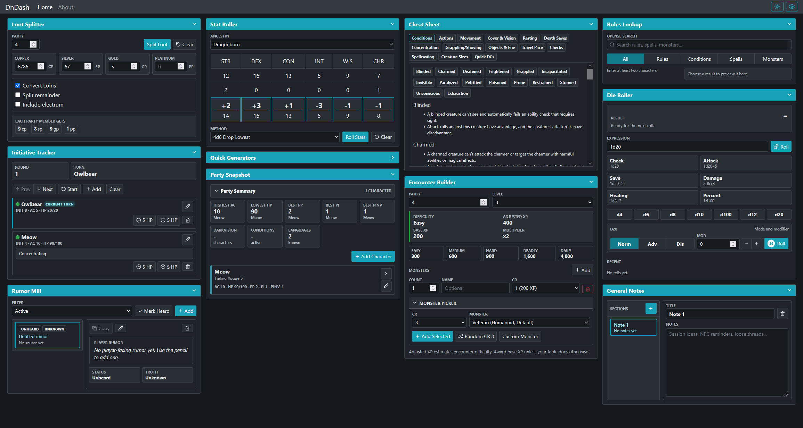

# DnDash
A virtual DM screen for D&D built with React and Vite.

Check out the dashboard [here](https://deadsnowman.github.io/dndash/)



DnDash keeps the little table jobs close at hand: rolling dice, splitting loot,
checking rules, sketching NPCs, shaping encounters, and adding quick flavor when
the session turns in an unexpected direction.

It is built as a collection of draggable cards, so each DM or player can keep the
tools they use most visible and hide the rest. Settings save your layout, card
order, visible cards, and Cheat Sheet tabs locally in the browser.

Includes tools for:

- Table utilities: currency conversion, loot splitting, dice rolling, and stat rolling
- DM generators: NPCs and names, encounters, magic item flavor, and monster picking
- Reference tools: combat actions, conditions, movement, and spellcasting basics

## Development

```sh
npm install
npm run dev
```

Vite will print a local URL, usually:

```text
http://localhost:5173/
```

React routes are hash-based for now:

```text
http://localhost:5173/#/home
http://localhost:5173/#/about
```

## GitHub Pages

The app uses hash routes and Vite is configured with relative asset paths, so it
can be served from a GitHub Pages project subpath.

To create a static build for GitHub Pages configured to serve from `/docs`:

```sh
npm run build:pages
```

Then commit the generated `docs/` directory and set GitHub Pages to deploy from
the `docs` folder on the publishing branch.
